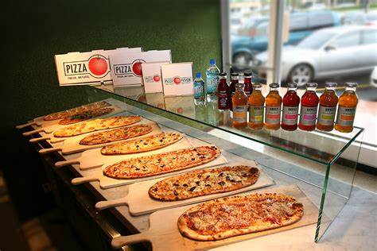

# Pizza-Place-Sales-Analysis

## Introduction
This is a power BI report on a fictitious store *“Pizza Place Sales”*. This report is to uncover actionable insights, provide answers to important business questions in order to make data driven decisions.

*Data Source: The data was gotten from Maven Analytics Website*

## Problem Statements
1.	How many customers do we have each day? Are there any peak hours?
2.	How many pizzas are typically in an order? Do we have any bestsellers?
3.	How much money did we make this year? Can we identify any seasonality in the sales?
4.	Are there any pizzas we should take of the menu, or any promotion we could leverage?

## Visualization

This report is a single page report that visualizes different KIP(s) to measure and monitor Pizza Place sales performance. It also featured product performance and uncover hidden patterns which the store can leverage  to maximize profit. to interact with this report click [Here](https://app.powerbi.com/view?r=eyJrIjoiOTRkNzM0ZjYtYTI2NS00OWQxLWE0MjgtMzEyMmY1MGRlM2U3IiwidCI6ImQ5MTZmMWVjLTA3MDktNDIzNC1iNDgyLTljYjIyOGUwZDk5NyJ9)

## Analysis
•	Classic Pizza accounted for 30.03% of quantities of pizza sold and generated highest revenue at **220,053.10**

•	The highest pizza revenue was generated in July while the lowest revenue was observed in October.

•	The store generated **817,860** annual revenue with **21,350** orders selling up to **49,574**thousand pizza.

•	The peak time for pizza order is from **12pm – 1pm** and **5pm – 6pm**

•	Sunday has the highest number of orders, the store has to ensure proper plan is in place to continuously meet customers demand.

## Conclusion & Recommendation
Classic Deluxe pizza appears to be the most popular pizza. Market basket analysis can be employed for effective promotional planning.

July recorded best sales further analysis should be conducted to discover factors that influenced surge in revenue.

Root Cause Analysis should be conducted on months that recorded poor performance

The store should stop making XXl size pizza since its patronage is very low
